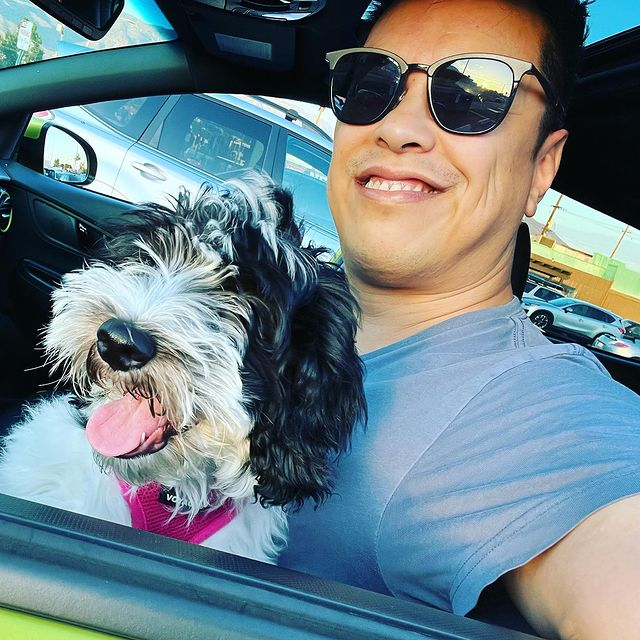

# Welcome to Programming Basics and Coding Dojo!

I'm Narciso Lobo, your instructor for this course. I've been with the Dojo for just over three years.

I've been coding off and on for over twenty years. I first started in 2000, and worked in the advertising industry as a front-end developer.

Afterwards, I concentrated on acting, music, and teaching the same while also creating websites freelance. Before coming to the Dojo, I worked in the construction industry for almost ten years.

In 2016, I was diagnosed with colon cancer. After recovering, I decided to change careers. My heart wasn't in construction and I didn't want to spend another gifted day pursuing something I didn't love.

In 2018, I came to the Dojo. I learned onsite at the Chicago campus. I had no knowledge about back-end programming, and my front-end skills needed polishing. They couldn't get rid of me. I devoured everything they threw at me and then some.

In 2020, I became a full-time instructor. I'm living proof that the Coding Dojo can change lives.